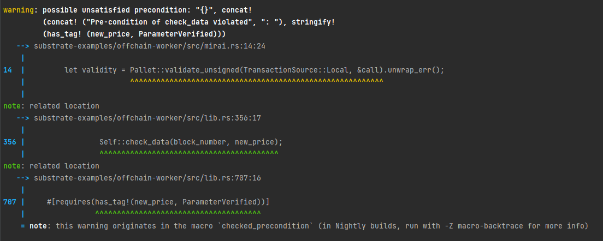

# Proof of Concept: Tag Analysis for validation of unsigned transactions

This is a copy of substrate's example of an [offchain worker](https://github.com/paritytech/substrate/tree/ea9ce4c0af36310c0b0db264ab12cf4766b83750/frame/examples/offchain-worker), enriched with a MIRAI [tag-analysis](https://github.com/facebookexperimental/MIRAI/blob/main/documentation/TagAnalysis.md). It is a first proof-of-concept for [validation of unsigned transactions](https://github.com/bhargavbh/MIRAI/blob/main/substrate_examples/unsigned-transaction/description.md).

# Running

To run the analysis [install mirai](https://github.com/facebookexperimental/MIRAI/blob/main/documentation/InstallationGuide.md) and run

`cargo mirai`

from within this folder. The [config.toml](.cargo/config.toml) makes sure, that the analysis only runs on the function [`mirai_check.code_to_analyze`](src/mirai.rs).

# Tag Analysis
We use [tag analysis](https://github.com/facebookexperimental/MIRAI/blob/main/documentation/TagAnalysis.md) from MIRAI. In this example, we want to verify that all parameters are properly verified before we call `check_data`. The tags are set in `validate_transaction_parameters` once the parameters pass the validation checks:
``` rust
    let current_block = <system::Pallet<T>>::block_number();
    if &current_block < block_number {
        return InvalidTransaction::Future.into()
    }
    add_tag!(block_number, ParameterVerified);
    
    // Arbitrary check that price is bigger than some value
    if 100 > *new_price {
        return InvalidTransaction::Future.into()
    }
    add_tag!(new_price, ParameterVerified);
```

The `check_data` function is currently not doing anything but it requires that the two parameters have the `ParameterVerified` tag:

``` rust
    #[requires(has_tag!(new_price, ParameterVerified))]
    #[requires(has_tag!(block_number, ParameterVerified))]
    fn check_data(
        block_number: &T::BlockNumber,
        new_price: &u32,
    ) {

    }
```

## Output

When we run ``cargo mirai``, ``check_data`` in line 356

``` rust
let res = Self::validate_transaction_parameters(block_number, new_price);
// uncomment the if-statement to get no warning
//if res.is_ok() {
Self::check_data(block_number, new_price);
//}
```

results in a warning:



When we call `check_data` only if the transaction is valid

``` rust
let res = Self::validate_transaction_parameters(block_number, new_price);
// uncomment the if-statement to get no warning
if res.is_ok() {
    Self::check_data(block_number, new_price);
}
```
the warning is not generated.


## Open issues

- One specific piece of code lead to a crash in MIRAI
- For more complex scenarios timeouts arise within MIRAI. In some cases increasing the `body_analysis_timeout` parameter leads to crashes in MIRAI.
- There are a variety of other warnings raised from code in other crates. This is confusing to the user.
- We also tried to do the tag check directly on the `submit_price_unsigned` function as this would be closer to a real world use-case but we did not manage to get this to work correctly. We believe this is due to timeouts that MIRAI ran into (see issue above) but further investigation would be needed to verify this is indeed the problem.
- In the debug log of MIRAI there are multiple log messages regarding a bug:
```
[0u]: &("internal error: entered unreachable code: /!\\ `LevelFilter` representation seems to have changed! /!\\ \nThis is a bug (and it's pretty bad). Please contact the `tracing` maintainers. Thank you and I'm sorry.\n The offending repr was: ")
```